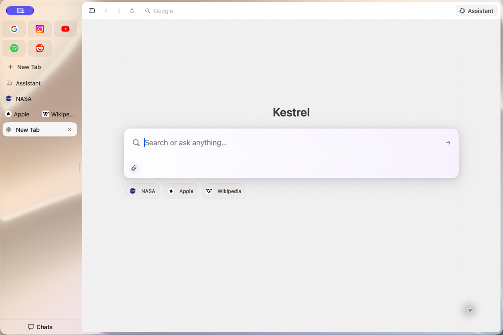
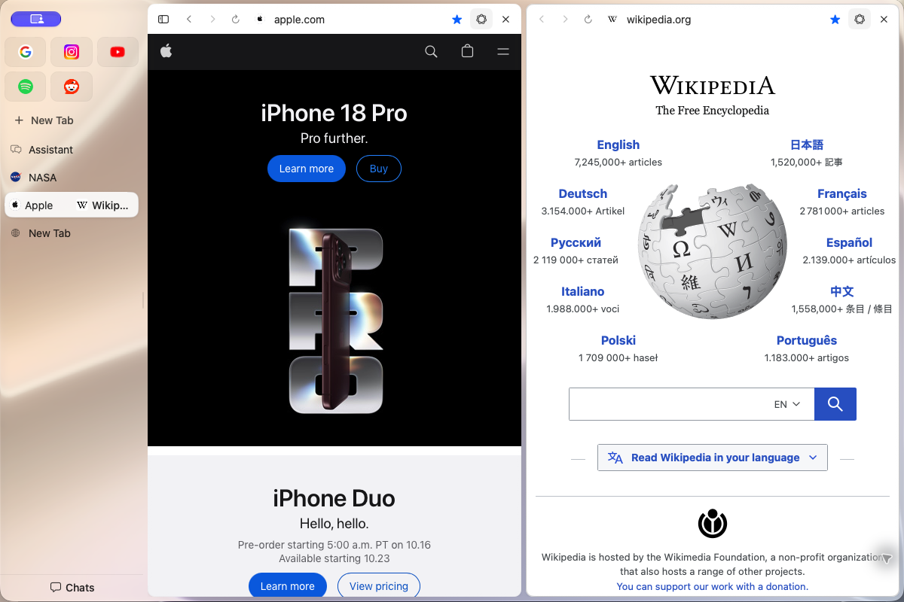
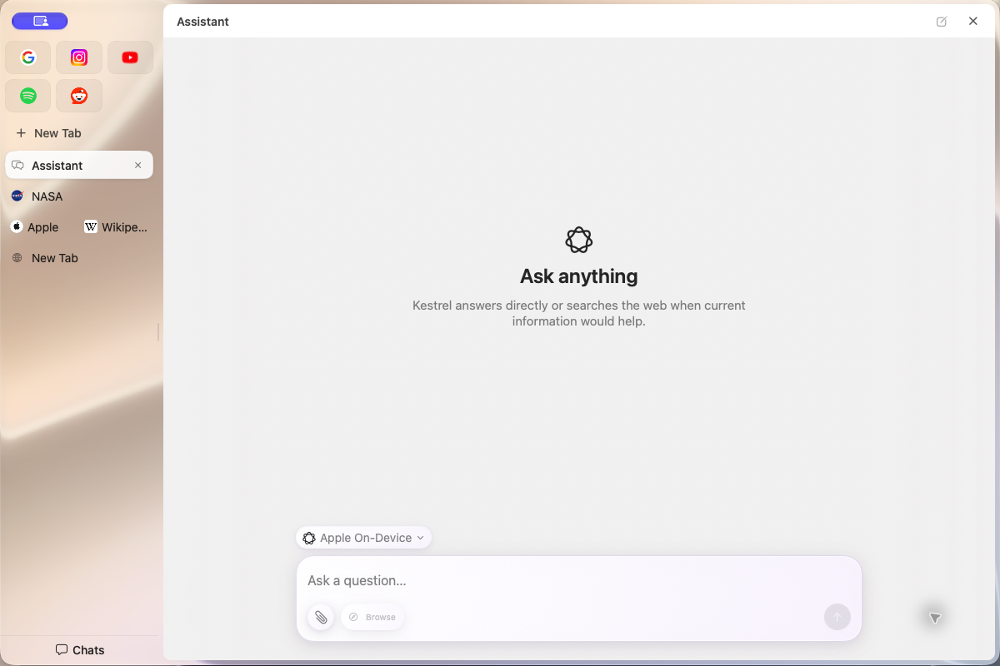
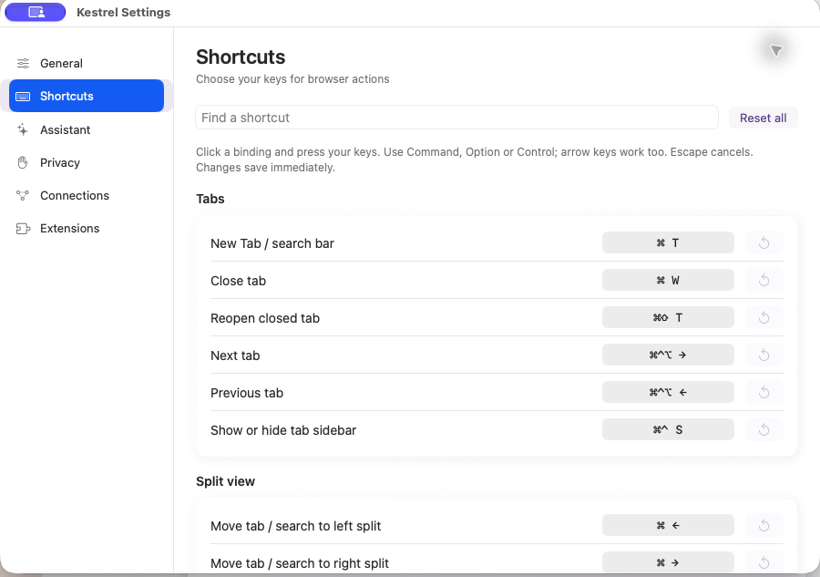

# Kestrel Browser

A native browser for macOS, built with Apple WebKit.

[Download the latest Kestrel Browser release](https://github.com/shay2000/Kestrel-Browser/releases/latest/download/Kestrel-Browser.zip) · [Release notes](https://github.com/shay2000/Kestrel-Browser/releases/latest)

Kestrel brings focused browsing, flexible split panes and a configurable assistant together in a Mac-first app.

## Features

- Independent browser panes with their own address bars and navigation.
- Custom keyboard shortcuts, tab groups and pinned pages.
- An assistant with optional web search and page context. Choose a provider in Settings.
- Local browser preferences and WebKit website storage.
- Built-in update checks, with **Kestrel → Check for Updates…** for a manual check.

Kestrel uses Apple's WebKit engine. Chromium extensions are not fully supported. Assistant page text may be sent to the selected provider when you use the assistant; review the provider and privacy controls in Settings.

## Screenshots

### New Tab, pins and bookmarks

The New Tab page brings search, pinned sites, open tabs and saved website shortcuts together.

### Split view

Each pane has its own address bar and page controls.

### Assistant

Choose a provider above the composer. Web search is managed in Settings.

### Custom keyboard shortcuts

Change bindings in Settings → Shortcuts, including the split-view keys.

## Requirements

- macOS 14 or later.
- Apple silicon or Intel Mac.

## Install

Download `Kestrel-Browser.zip`, open it, then move `Kestrel.app` to Applications. This first release is ad-hoc signed and is not notarized; macOS may show a Gatekeeper warning when you first open it. We will label signing and notarization status for each release.

## Source code

Source code is private for now. I plan to attach it only after cleaning up the code and verifying that identifying marks have been removed. For now, this repository contains prebuilt releases, screenshots and release notes only.
